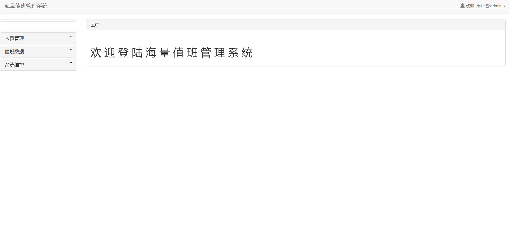

## 基于SSM框架实现一个值班管理系统

- <b>完整代码获取地址：从戎源码网 ([https://armycodes.com/](https://armycodes.com/))</b>
- <b>技术探讨、资料分享，请加QQ群：692619798</b> 
- <b>作者微信：19941326836  QQ：952045282</b> 
- <b>承接计算机毕业设计、Java毕业设计、Python毕业设计、深度学习、机器学习</b>
- <b>选题+开题报告+任务书+程序定制+安装调试+论文+答辩ppt 一条龙服务</b>
- <b>所有选题地址 ([https://github.com/YuLin-Coder/AllProjectCatalog](https://github.com/YuLin-Coder/AllProjectCatalog)) </b>

## 项目介绍
基于SSM框架实现一个值班管理系统, 并基于Shiro实现一个基于角色的访问控制系统, 该值班系统能够对用户, 角色, 角色权限, 值班啊信息进行管理, 并能导出excel列表, 还能查看历史操作

实现功能
该项目实现了一个带多角色访问控制的值班管理系统, 该系统实现了如下功能
分页查询值班列表功能
值班信息的增加, 删除, 修改
多角色的登录退出功能
系统管理员能够对角色进行修改, 能够对角色分配权限
系统能够批量导出excel报表功能

## 项目技术
- 编程语言：Java
- 数据库：MySQL
- 前端技术：JSP、JavaScript、Jquery、bootstrap
- 后端技术：Spring、SpringMVC、MyBatis

## 运行环境
- JDK版本：JDK1.8及以上
- 开发工具：IDEA、Ecplise、Myecplise都可以
- 数据库: MySQL5.7及以上

## 运行截图

